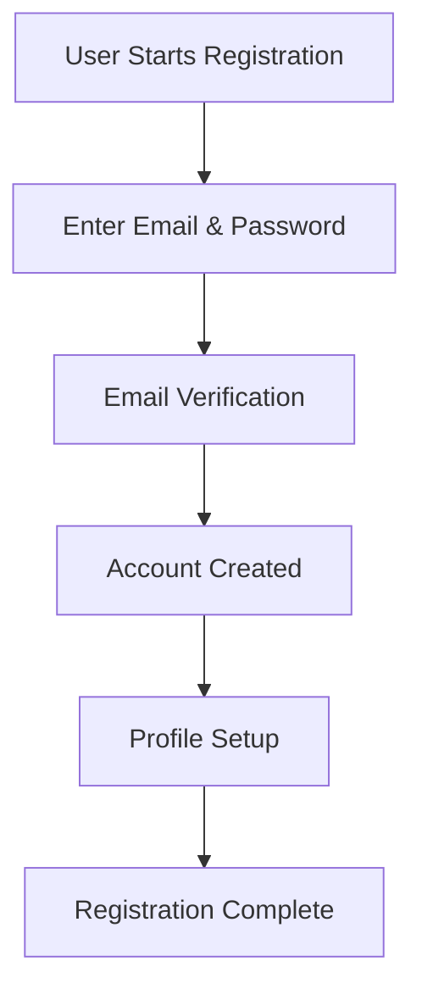
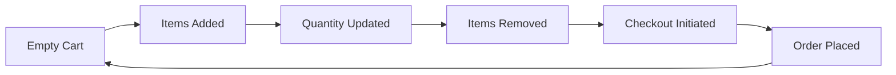

# Chapter 3: Requirement Analysis

## Table of Contents

3.1 Introduction to Requirement Analysis
3.2 Functional Requirements
    3.2.1 User Management Requirements
    3.2.2 Product Management Requirements
    3.2.3 Shopping Cart Requirements
    3.2.4 Order Management Requirements
    3.2.5 Payment Processing Requirements
    3.2.6 Search and Filtering Requirements
    3.2.7 Review and Rating Requirements
    3.2.8 Admin Panel Requirements
    3.2.9 Notification Requirements
    3.2.10 Reporting Requirements
3.3 Non-Functional Requirements
    3.3.1 Performance Requirements
    3.3.2 Security Requirements
    3.3.3 Usability Requirements
    3.3.4 Reliability Requirements
    3.3.5 Scalability Requirements
    3.3.6 Compatibility Requirements
    3.3.7 Maintainability Requirements
    3.3.8 Accessibility Requirements
3.4 Hardware & Software Requirements
    3.4.1 Server Hardware Requirements
    3.4.2 Client Hardware Requirements
    3.4.3 Software Requirements
    3.4.4 Network Requirements
    3.4.5 Storage Requirements
3.5 Feasibility Study
    3.5.1 Technical Feasibility
    3.5.2 Economic Feasibility
    3.5.3 Operational Feasibility
    3.5.4 Legal Feasibility
    3.5.5 Schedule Feasibility
3.6 Requirement Prioritization
3.7 Risk Analysis
3.8 Conclusion and Recommendations

---

## 3.1 Introduction to Requirement Analysis

Requirement analysis is a critical phase in the software development lifecycle that defines the foundation for successful project implementation. This chapter comprehensively documents the functional and non-functional requirements for VEBStore, an advanced e-commerce platform designed to meet the evolving needs of modern digital commerce.

### 3.1.1 Purpose and Scope

The purpose of this requirement analysis is to:
- Define clear, measurable, and achievable requirements
- Establish a common understanding among stakeholders
- Provide a foundation for system design and development
- Ensure alignment with business objectives and user needs
- Facilitate accurate project planning and resource allocation

### 3.1.2 Methodology

The requirements were gathered through:
- Market research and competitor analysis
- User surveys and interviews
- Stakeholder consultations
- Technical feasibility assessments
- Industry best practices review

### 3.1.3 Target Audience

This analysis addresses the needs of:
- End customers (B2C and B2B)
- Store administrators and merchants
- Platform developers and maintainers
- Business stakeholders and investors

---

## 3.2 Functional Requirements

### 3.2.1 User Management Requirements

#### 3.2.1.1 User Registration and Authentication

| Requirement ID | Description | Priority | Acceptance Criteria |
|----------------|-------------|----------|---------------------|
| FR-UM-001 | User Registration | High | Users can register with email and password |
| FR-UM-002 | Email Verification | High | Users must verify email before account activation |
| FR-UM-003 | Social Login Integration | Medium | Support for Google, Facebook, Apple login |
| FR-UM-004 | Password Recovery | High | Users can reset forgotten passwords via email |
| FR-UM-005 | Two-Factor Authentication | Medium | Optional 2FA for enhanced security |
| FR-UM-006 | Account Deletion | High | Users can permanently delete their accounts |

**Registration Process Flow:**


#### 3.2.1.2 User Profile Management

| Requirement ID | Description | Priority | Acceptance Criteria |
|----------------|-------------|----------|---------------------|
| FR-UM-007 | Profile Creation | High | Users must create basic profile after registration |
| FR-UM-008 | Profile Editing | High | Users can update personal information |
| FR-UM-009 | Address Management | High | Multiple shipping and billing addresses |
| FR-UM-010 | Payment Methods | High | Save and manage multiple payment methods |
| FR-UM-011 | Order History | High | View complete order history |
| FR-UM-012 | Wishlist Management | Medium | Create and manage multiple wishlists |

### 3.2.2 Product Management Requirements

#### 3.2.2.1 Product Catalog Management

| Requirement ID | Description | Priority | Acceptance Criteria |
|----------------|-------------|----------|---------------------|
| FR-PM-001 | Product Addition | High | Admin can add products with all details |
| FR-PM-002 | Product Editing | High | Admin can modify all product attributes |
| FR-PM-003 | Product Deletion | High | Admin can remove products with confirmation |
| FR-PM-004 | Bulk Operations | Medium | Bulk import/export of products |
| FR-PM-005 | Product Categories | High | Hierarchical category structure |
| FR-PM-006 | Product Attributes | High | Custom attributes and variants |
| FR-PM-007 | Inventory Management | High | Real-time stock tracking |
| FR-PM-008 | Product Images | High | Multiple high-quality images per product |

**Product Data Structure:**
```
Product {
  id: String
  name: String
  description: String
  price: Number
  category: String
  subCategory: String
  images: Array[String]
  attributes: Object
  inventory: Number
  variants: Array[Variant]
  reviews: Array[Review]
  metadata: Object
}
```

#### 3.2.2.2 Product Search and Discovery

| Requirement ID | Description | Priority | Acceptance Criteria |
|----------------|-------------|----------|---------------------|
| FR-PM-009 | Basic Search | High | Search by product name and description |
| FR-PM-010 | Advanced Search | High | Filter by category, price, attributes |
| FR-PM-011 | Auto-complete | Medium | Search suggestions as user types |
| FR-PM-012 | Faceted Navigation | High | Multi-dimensional filtering |
| FR-PM-013 | Product Recommendations | Medium | AI-powered product suggestions |
| FR-PM-014 | Recently Viewed | Low | Track and display recently viewed products |

### 3.2.3 Shopping Cart Requirements

#### 3.2.3.1 Cart Operations

| Requirement ID | Description | Priority | Acceptance Criteria |
|----------------|-------------|----------|---------------------|
| FR-SC-001 | Add to Cart | High | Users can add products to cart |
| FR-SC-002 | Update Quantity | High | Modify item quantities in cart |
| FR-SC-003 | Remove Items | High | Remove items from cart |
| FR-SC-004 | Cart Persistence | High | Cart contents saved across sessions |
| FR-SC-005 | Guest Cart | High | Non-registered users can use cart |
| FR-SC-006 | Cart Sharing | Low | Share cart contents with others |
| FR-SC-007 | Bulk Operations | Medium | Add multiple items at once |

**Cart State Management:**


#### 3.2.3.2 Cart Features

| Requirement ID | Description | Priority | Acceptance Criteria |
|----------------|-------------|----------|---------------------|
| FR-SC-008 | Price Calculation | High | Real-time price including taxes |
| FR-SC-009 | Discount Application | High | Apply promo codes and discounts |
| FR-SC-010 | Shipping Estimation | High | Calculate shipping costs |
| FR-SC-011 | Tax Calculation | High | Automatic tax calculation |
| FR-SC-012 | Cart Abandonment | Medium | Track and recover abandoned carts |

### 3.2.4 Order Management Requirements

#### 3.2.4.1 Order Processing

| Requirement ID | Description | Priority | Acceptance Criteria |
|----------------|-------------|----------|---------------------|
| FR-OM-001 | Order Placement | High | Complete checkout process |
| FR-OM-002 | Order Confirmation | High | Email and SMS confirmations |
| FR-OM-003 | Order Tracking | High | Real-time order status updates |
| FR-OM-004 | Order Modification | Medium | Modify orders before shipment |
| FR-OM-005 | Order Cancellation | High | Cancel orders with refund |
| FR-OM-006 | Return Management | High | Process returns and exchanges |
| FR-OM-007 | Order History | High | Complete order history for users |

#### 3.2.4.2 Order Status Management

| Status | Description | User Actions | System Actions |
|--------|-------------|--------------|----------------|
| Pending | Order received, awaiting processing | View, Cancel | Send confirmation |
| Processing | Payment confirmed, preparing shipment | View | Update inventory |
| Shipped | Order shipped, tracking available | Track | Send tracking info |
| Delivered | Order delivered successfully | Review Request | Mark complete |
| Cancelled | Order cancelled by user or system | Reorder | Process refund |
| Returned | Product returned, refund processed | Reorder | Update inventory |

### 3.2.5 Payment Processing Requirements

#### 3.2.5.1 Payment Methods

| Requirement ID | Description | Priority | Acceptance Criteria |
|----------------|-------------|----------|---------------------|
| FR-PP-001 | Credit/Debit Cards | High | Support major card providers |
| FR-PP-002 | Digital Wallets | High | PayPal, Apple Pay, Google Pay |
| FR-PP-003 | Bank Transfers | Medium | Direct bank transfers |
| FR-PP-004 | Cryptocurrency | Low | Bitcoin, Ethereum support |
| FR-PP-005 | Buy Now Pay Later | Medium | Klarna, Afterpay integration |
| FR-PP-006 | Gift Cards | Medium | Platform gift cards |
| FR-PP-007 | Store Credit | Medium | Customer credit system |

#### 3.2.5.2 Payment Security

| Requirement ID | Description | Priority | Acceptance Criteria |
|----------------|-------------|----------|---------------------|
| FR-PP-008 | PCI DSS Compliance | High | Level 1 PCI compliance |
| FR-PP-009 | Tokenization | High | Secure payment token storage |
| FR-PP-010 | Fraud Detection | High | Real-time fraud screening |
| FR-PP-011 | 3D Secure | High | 3D Secure 2.0 support |
| FR-PP-012 | SSL/TLS Encryption | High | All payment data encrypted |
| FR-PP-013 | Audit Logging | High | Complete payment audit trail |

### 3.2.6 Search and Filtering Requirements

#### 3.2.6.1 Search Functionality

| Requirement ID | Description | Priority | Acceptance Criteria |
|----------------|-------------|----------|---------------------|
| FR-SF-001 | Keyword Search | High | Search by product name, description |
| FR-SF-002 | Category Search | High | Search within specific categories |
| FR-SF-003 | Attribute Search | High | Search by product attributes |
| FR-SF-004 | Price Range Search | High | Filter by price range |
| FR-SF-005 | Brand Search | Medium | Search by brand name |
| FR-SF-006 | SKU Search | Medium | Search by product SKU |
| FR-SF-007 | Advanced Filters | High | Multiple filter combinations |

#### 3.2.6.2 Search Performance

| Metric | Target | Measurement Method |
|--------|--------|-------------------|
| Search Response Time | <200ms | Load testing |
| Search Accuracy | >95% | User testing |
| Search Coverage | 100% | Automated testing |
| Index Update Time | <5min | System monitoring |
| Search Relevance | >90% | User feedback |

### 3.2.7 Review and Rating Requirements

#### 3.2.7.1 Customer Reviews

| Requirement ID | Description | Priority | Acceptance Criteria |
|----------------|-------------|----------|---------------------|
| FR-RR-001 | Product Reviews | High | Customers can review purchased products |
| FR-RR-002 | Star Ratings | High | 1-5 star rating system |
| FR-RR-003 | Review Moderation | High | Admin can moderate reviews |
| FR-RR-004 | Review Photos | Medium | Upload photos with reviews |
| FR-RR-005 | Helpful Votes | Low | Vote on review helpfulness |
| FR-RR-006 | Review Responses | Medium | Sellers can respond to reviews |
| FR-RR-007 | Review Analytics | Medium | Review sentiment analysis |

#### 3.2.7.2 Rating System

| Rating | Description | Weight | Impact |
|--------|-------------|--------|--------|
| 5 Stars | Excellent | 1.0 | Full positive impact |
| 4 Stars | Good | 0.8 | Strong positive impact |
| 3 Stars | Average | 0.6 | Neutral impact |
| 2 Stars | Poor | 0.4 | Negative impact |
| 1 Star | Very Poor | 0.2 | Strong negative impact |

### 3.2.8 Admin Panel Requirements

#### 3.2.8.1 Dashboard Features

| Requirement ID | Description | Priority | Acceptance Criteria |
|----------------|-------------|----------|---------------------|
| FR-AP-001 | Sales Dashboard | High | Real-time sales metrics |
| FR-AP-002 | Product Dashboard | High | Product performance metrics |
| FR-AP-003 | Customer Dashboard | High | Customer analytics |
| FR-AP-004 | Order Dashboard | High | Order management interface |
| FR-AP-005 | Inventory Dashboard | High | Stock level monitoring |
| FR-AP-006 | Financial Dashboard | High | Revenue and profit tracking |
| FR-AP-007 | Marketing Dashboard | Medium | Campaign performance |

#### 3.2.8.2 Admin Operations

| Operation | Description | Frequency | Complexity |
|-----------|-------------|-----------|------------|
| Product Management | Add/edit/delete products | Daily | Medium |
| Order Processing | Process and fulfill orders | Daily | High |
| Customer Support | Handle customer inquiries | Daily | Medium |
| Inventory Update | Update stock levels | Daily | Low |
| Report Generation | Generate business reports | Weekly | Medium |
| System Maintenance | System updates and backups | Monthly | High |

### 3.2.9 Notification Requirements

#### 3.2.9.1 Notification Types

| Type | Trigger | Channel | Frequency |
|------|---------|---------|-----------|
| Order Confirmation | Order placed | Email, SMS | Immediate |
| Shipping Update | Order shipped | Email, SMS | Immediate |
| Delivery Confirmation | Order delivered | Email | Immediate |
| Promotional | Marketing campaigns | Email, Push | Scheduled |
| Abandoned Cart | Cart abandoned | Email, Push | 1 hour, 24 hours |
| Low Stock | Inventory low | Email, Dashboard | Real-time |
| System Alerts | System issues | Email, SMS | Immediate |

#### 3.2.9.2 Notification Preferences

| Preference | Options | Default | User Control |
|------------|----------|---------|-------------|
| Email Notifications | On/Off | On | Yes |
| SMS Notifications | On/Off | On | Yes |
| Push Notifications | On/Off | On | Yes |
| Marketing Emails | On/Off | On | Yes |
| Order Updates | On/Off | On | Yes |
| Promotional Alerts | On/Off | On | Yes |

### 3.2.10 Reporting Requirements

#### 3.2.10.1 Business Reports

| Report Type | Description | Generation Frequency | Format |
|-------------|-------------|---------------------|--------|
| Sales Report | Revenue and sales metrics | Daily/Weekly/Monthly | PDF, Excel |
| Inventory Report | Stock levels and movements | Daily/Weekly | PDF, Excel |
| Customer Report | Customer analytics | Monthly | PDF, Excel |
| Product Report | Product performance | Monthly | PDF, Excel |
| Financial Report | Revenue and profit | Monthly/Quarterly | PDF, Excel |
| Marketing Report | Campaign effectiveness | Monthly | PDF, Excel |

#### 3.2.10.2 Report Metrics

| Metric | Calculation | Source | Update Frequency |
|--------|-------------|--------|------------------|
| Total Revenue | Sum of all order amounts | Orders table | Real-time |
| Average Order Value | Total Revenue / Order Count | Orders table | Real-time |
| Conversion Rate | Orders / Sessions | Analytics | Daily |
| Customer Lifetime Value | Total Revenue / Customer Count | Orders table | Monthly |
| Cart Abandonment Rate | Abandoned Carts / Total Carts | Cart table | Real-time |
| Product Return Rate | Returned Orders / Total Orders | Orders table | Monthly |

---

## 3.3 Non-Functional Requirements

### 3.3.1 Performance Requirements

#### 3.3.1.1 Response Time Requirements

| Component | Target Response Time | Measurement Method | Acceptable Range |
|-----------|---------------------|-------------------|-----------------|
| Page Load | <2 seconds | Real User Monitoring | 1-3 seconds |
| API Response | <200ms | Load Testing | 100-500ms |
| Database Query | <100ms | Performance Monitoring | 50-200ms |
| Search Query | <300ms | Load Testing | 100-500ms |
| Image Loading | <1 second | Performance Monitoring | 0.5-2 seconds |
| Checkout Process | <30 seconds | User Testing | 20-45 seconds |

#### 3.3.1.2 Throughput Requirements

| Metric | Target | Measurement | Peak Load |
|--------|--------|-------------|-----------|
| Concurrent Users | 10,000 | Load Testing | 50,000 |
| Requests/Second | 5,000 | Load Testing | 20,000 |
| Orders/Minute | 100 | Load Testing | 500 |
| Search Queries/Second | 1,000 | Load Testing | 5,000 |
| Database Transactions | 10,000 | Database Monitoring | 50,000 |

#### 3.3.1.3 Scalability Requirements

| Scalability Aspect | Current Capacity | Target Capacity | Growth Strategy |
|--------------------|------------------|-----------------|----------------|
| User Base | 100,000 | 1,000,000 | Horizontal scaling |
| Product Catalog | 1M products | 10M products | Database sharding |
| Order Volume | 10K/day | 100K/day | Microservices |
| Traffic | 1M visits/month | 10M visits/month | CDN + Load balancing |
| Storage | 1TB | 10TB | Cloud storage |

### 3.3.2 Security Requirements

#### 3.3.2.1 Authentication and Authorization

| Security Requirement | Implementation | Compliance Level | Testing Frequency |
|---------------------|----------------|------------------|------------------|
| Password Policy | Hashing (bcrypt) | OWASP | Quarterly |
| Session Management | JWT tokens | OWASP | Monthly |
| Access Control | RBAC | OWASP | Quarterly |
| Multi-Factor Auth | TOTP/Email | PCI DSS | Monthly |
| API Security | OAuth 2.0 | OAuth 2.0 | Quarterly |
| Data Encryption | AES-256 | GDPR | Continuous |

#### 3.3.2.2 Data Protection

| Data Type | Protection Method | Retention Period | Compliance |
|-----------|------------------|------------------|------------|
| Personal Data | Encryption at rest/transit | 7 years | GDPR |
| Payment Data | Tokenization | 6 years | PCI DSS |
| Order History | Encryption | 10 years | GDPR |
| IP Addresses | Anonymization | 2 years | GDPR |
| Analytics Data | Aggregation | 2 years | GDPR |
| Logs | Encrypted storage | 90 days | GDPR |

#### 3.3.2.3 Security Monitoring

| Security Aspect | Monitoring Tool | Alert Threshold | Response Time |
|----------------|------------------|-----------------|--------------|
| Failed Logins | SIEM System | 5 attempts/minute | <5 minutes |
| Suspicious Activity | Anomaly Detection | Deviation >3σ | <10 minutes |
| Vulnerability Scans | Automated Scanner | Any critical CVE | <24 hours |
| Data Breach | DLP System | Any unauthorized access | <1 hour |
| Performance | APM Tools | Response time >2s | <15 minutes |

### 3.3.3 Usability Requirements

#### 3.3.3.1 User Experience Metrics

| Metric | Target | Measurement Method | Industry Standard |
|--------|--------|-------------------|-----------------|
| User Satisfaction | >4.5/5 | User Surveys | 4.0/5 |
| Task Completion Rate | >95% | User Testing | 85% |
| Error Rate | <5% | Analytics | 10% |
| Learnability | <30 minutes | User Testing | 60 minutes |
| Accessibility Score | WCAG 2.1 AA | Accessibility Testing | WCAG 2.0 A |
| Mobile Usability | >90% | Mobile Testing | 80% |

#### 3.3.3.2 Interface Design Requirements

| Design Aspect | Requirement | Implementation | Validation |
|---------------|-------------|----------------|------------|
| Responsive Design | All devices | CSS Media Queries | Device Testing |
| Consistency | Unified design language | Design System | Code Review |
| Navigation | Intuitive menu structure | User Testing | A/B Testing |
| Feedback | Clear user feedback | Toast notifications | User Testing |
| Error Handling | Graceful error messages | Error boundaries | User Testing |
| Loading States | Visual loading indicators | Spinners/skeletons | User Testing |

### 3.3.4 Reliability Requirements

#### 3.3.4.1 Availability Targets

| System Component | Availability Target | Downtime Allowance | Measurement |
|------------------|--------------------|-------------------|-------------|
| Web Application | 99.9% | 8.76 hours/year | Uptime monitoring |
| Database | 99.95% | 4.38 hours/year | Database monitoring |
| Payment Gateway | 99.99% | 52.6 minutes/year | Payment monitoring |
| CDN | 99.95% | 4.38 hours/year | CDN monitoring |
| Email Service | 99.9% | 8.76 hours/year | Email monitoring |
| Backup Systems | 99.99% | 52.6 minutes/year | Backup testing |

#### 3.3.4.2 Fault Tolerance

| Failure Scenario | Recovery Time | Data Loss | Recovery Strategy |
|------------------|---------------|-----------|-----------------|
| Server Failure | <5 minutes | None | Auto-failover |
| Database Failure | <15 minutes | <1 minute | Replication |
| Network Failure | <2 minutes | None | Redundant connections |
| Power Failure | <10 minutes | None | UPS + Generator |
| Data Corruption | <1 hour | <5 minutes | Regular backups |
| Security Breach | <30 minutes | None | Incident response |

### 3.3.5 Scalability Requirements

#### 3.3.5.1 Horizontal Scaling Strategy

| Component | Scaling Method | Auto-scaling Trigger | Maximum Capacity |
|-----------|----------------|-------------------|-----------------|
| Web Servers | Load balancing | CPU >70% | 100 instances |
| Database | Read replicas | Connections >80% | 20 replicas |
| Cache | Redis cluster | Memory >80% | 50 nodes |
| Storage | Distributed storage | Disk >80% | Unlimited |
| CDN | Edge locations | Traffic >80% | Global coverage |

#### 3.3.5.2 Performance Under Load

| Load Scenario | Concurrent Users | Response Time | Throughput | Success Rate |
|---------------|------------------|--------------|-----------|-------------|
| Normal Load | 1,000 | <200ms | 1,000 req/s | 99.9% |
| Peak Load | 10,000 | <500ms | 5,000 req/s | 99.5% |
| Stress Test | 50,000 | <1s | 10,000 req/s | 95% |
| Spike Load | 25,000 | <750ms | 7,500 req/s | 98% |

### 3.3.6 Compatibility Requirements

#### 3.3.6.1 Browser Compatibility

| Browser | Minimum Version | Market Share | Testing Frequency |
|---------|------------------|--------------|------------------|
| Chrome | 90+ | 65% | Every release |
| Safari | 14+ | 18% | Every release |
| Firefox | 88+ | 8% | Every release |
| Edge | 90+ | 4% | Every release |
| Mobile Safari | 14+ | 15% | Every release |
| Chrome Mobile | 90+ | 25% | Every release |

#### 3.3.6.2 Device Compatibility

| Device Type | Screen Size | Resolution | Testing Approach |
|-------------|-------------|------------|------------------|
| Desktop | 1024px+ | 1920x1080 | Responsive testing |
| Tablet | 768px-1023px | 1024x768 | Device testing |
| Mobile | 320px-767px | 375x667 | Device testing |
| Large Screen | 1920px+ | 2560x1440 | Responsive testing |

### 3.3.7 Maintainability Requirements

#### 3.3.7.1 Code Quality Standards

| Quality Metric | Target | Measurement Tool | Frequency |
|----------------|--------|-------------------|----------|
| Code Coverage | >90% | Jest/Istanbul | Every build |
| Cyclomatic Complexity | <10 | SonarQube | Every commit |
| Technical Debt | <5 days | SonarQube | Weekly |
| Documentation Coverage | >80% | Documentation tools | Every release |
| Code Duplication | <3% | SonarQube | Weekly |
| Security Vulnerabilities | 0 critical | SAST tools | Every build |

#### 3.3.7.2 Maintenance Processes

| Process | Frequency | Duration | Impact |
|---------|-----------|---------|--------|
| Code Review | Every commit | <30 minutes | Quality assurance |
| Database Maintenance | Weekly | <2 hours | Performance |
| Security Updates | Monthly | <4 hours | Security |
| Performance Tuning | Quarterly | <8 hours | Performance |
| Dependency Updates | Monthly | <2 hours | Security |
| Backup Testing | Monthly | <1 hour | Reliability |

### 3.3.8 Accessibility Requirements

#### 3.3.8.1 WCAG 2.1 Compliance

| WCAG Principle | Level | Implementation | Testing |
|---------------|-------|----------------|---------|
| Perceivable | AA | Alt text, color contrast | Automated testing |
| Operable | AA | Keyboard navigation | Manual testing |
| Understandable | AA | Clear language, instructions | User testing |
| Robust | AA | Compatible with assistive tech | Accessibility testing |

#### 3.3.8.2 Accessibility Features

| Feature | Implementation | Benefit | Testing |
|---------|----------------|--------|--------|
| Screen Reader Support | ARIA labels | Visually impaired users | Screen reader testing |
| Keyboard Navigation | Tab order | Motor impaired users | Keyboard testing |
| Color Contrast | WCAG ratios | Low vision users | Contrast testing |
| Text Resizing | Responsive text | Low vision users | Zoom testing |
| Focus Indicators | Visible focus | Keyboard users | Visual testing |

---

## 3.4 Hardware & Software Requirements

### 3.4.1 Server Hardware Requirements

#### 3.4.1.1 Production Environment

| Component | Minimum Specification | Recommended Specification | Purpose |
|-----------|----------------------|-------------------------|---------|
| CPU | 8 cores @ 2.4GHz | 16 cores @ 3.0GHz | Application processing |
| RAM | 32GB | 64GB | Application cache and processing |
| Storage | 500GB SSD | 1TB NVMe SSD | Application and database storage |
| Network | 1Gbps | 10Gbps | Network connectivity |
| Backup | 1TB external | 2TB RAID array | Data backup and recovery |
| Load Balancer | Software-based | Hardware-based | Traffic distribution |

#### 3.4.1.2 Database Server Requirements

| Component | Minimum | Recommended | Scaling Strategy |
|-----------|----------|-------------|-----------------|
| CPU | 4 cores @ 2.4GHz | 8 cores @ 3.0GHz | Vertical/horizontal |
| RAM | 16GB | 32GB | Vertical scaling |
| Storage | 256GB SSD | 1TB NVMe SSD | Horizontal sharding |
| Network | 1Gbps | 10Gbps | Load balancing |
| Replication | Master-slave | Multi-master | High availability |

#### 3.4.1.3 Development Environment

| Component | Minimum | Recommended | Purpose |
|-----------|----------|-------------|---------|
| CPU | 4 cores @ 2.0GHz | 8 cores @ 2.4GHz | Development and testing |
| RAM | 16GB | 32GB | IDE and tools |
| Storage | 256GB SSD | 512GB NVMe SSD | Source code and dependencies |
| Network | 100Mbps | 1Gbps | Internet connectivity |

### 3.4.2 Client Hardware Requirements

#### 3.4.2.1 Desktop Requirements

| Specification | Minimum | Recommended | Target Audience |
|--------------|----------|-------------|----------------|
| CPU | Dual-core @ 1.5GHz | Quad-core @ 2.0GHz | General users |
| RAM | 4GB | 8GB | Power users |
| Storage | 10GB free | 20GB free | Application cache |
| Graphics | Integrated | Dedicated 2GB | Enhanced experience |
| Network | Broadband | High-speed broadband | Optimal performance |

#### 3.4.2.2 Mobile Requirements

| Device Type | Minimum OS | Recommended OS | Key Features |
|-------------|------------|----------------|-------------|
| iOS | iOS 12+ | iOS 15+ | Safari browser |
| Android | Android 8+ | Android 12+ | Chrome browser |
| RAM | 2GB | 4GB | Application performance |
| Storage | 1GB free | 2GB free | Cache and data |
| Network | 4G LTE | 5G | Faster loading |

### 3.4.3 Software Requirements

#### 3.4.3.1 Server Software Stack

| Software | Version | Purpose | License |
|----------|---------|---------|---------|
| Node.js | 18.x LTS | Runtime environment | MIT |
| MongoDB | 6.x | Database | SSPL |
| Redis | 7.x | Caching | BSD |
| Nginx | 1.20+ | Web server | BSD |
| Docker | 20.x+ | Containerization | Apache 2.0 |
| Kubernetes | 1.25+ | Orchestration | Apache 2.0 |

#### 3.4.3.2 Development Tools

| Tool | Version | Purpose | License |
|------|---------|---------|---------|
| VS Code | 1.80+ | IDE | MIT |
| Git | 2.40+ | Version control | GPL |
| npm | 9.x | Package manager | MIT |
| React | 18.x | Frontend framework | MIT |
| TypeScript | 5.x | Type safety | Apache 2.0 |
| Jest | 29.x | Testing | MIT |

#### 3.4.3.3 Monitoring and Analytics

| Tool | Version | Purpose | Cost |
|------|---------|---------|------|
| Google Analytics | 4.x | User analytics | Free |
| Sentry | Latest | Error tracking | Freemium |
| New Relic | Latest | APM monitoring | Paid |
| Datadog | Latest | Infrastructure monitoring | Paid |
| LogRocket | Latest | Session replay | Paid |

### 3.4.4 Network Requirements

#### 3.4.4.1 Bandwidth Requirements

| User Type | Concurrent Users | Bandwidth per User | Total Bandwidth |
|-----------|------------------|-------------------|-----------------|
| Casual | 1,000 | 1 Mbps | 1 Gbps |
| Power | 500 | 2 Mbps | 1 Gbps |
| Mobile | 2,000 | 500 Kbps | 1 Gbps |
| Admin | 100 | 5 Mbps | 500 Mbps |
| API | 10,000 | 100 Kbps | 1 Gbps |

#### 3.4.4.2 Latency Requirements

| Region | Target Latency | Maximum Acceptable | CDN Coverage |
|--------|----------------|------------------|--------------|
| North America | <50ms | 100ms | 100% |
| Europe | <100ms | 200ms | 100% |
| Asia | <150ms | 300ms | 95% |
| South America | <200ms | 400ms | 90% |
| Africa | <250ms | 500ms | 80% |

### 3.4.5 Storage Requirements

#### 3.4.5.1 Data Storage Estimates

| Data Type | Current Size | Annual Growth | 5-Year Projection |
|-----------|-------------|---------------|-------------------|
| Product Images | 100GB | 50GB | 350GB |
| User Data | 10GB | 5GB | 35GB |
| Order Data | 20GB | 10GB | 70GB |
| Logs | 50GB | 25GB | 175GB |
| Backups | 200GB | 100GB | 700GB |
| Total | 380GB | 190GB | 1.33TB |

#### 3.4.5.2 Backup Strategy

| Backup Type | Frequency | Retention | Storage Location |
|-------------|-----------|----------|-----------------|
| Full Backup | Daily | 30 days | Cloud storage |
| Incremental | Hourly | 7 days | Local storage |
| Database | Every 15 min | 90 days | Cloud storage |
| Files | Daily | 90 days | Cloud storage |
| Disaster Recovery | Weekly | 1 year | Off-site storage |

---

## 3.5 Feasibility Study

### 3.5.1 Technical Feasibility

#### 3.5.1.1 Technology Assessment

| Technology | Maturity | Learning Curve | Risk Level | Recommendation |
|------------|----------|---------------|------------|----------------|
| Node.js | High | Low | Low | Adopt |
| React | High | Low | Low | Adopt |
| MongoDB | High | Low | Low | Adopt |
| Redis | High | Low | Low | Adopt |
| Docker | High | Medium | Low | Adopt |
| Kubernetes | High | High | Medium | Adopt with training |
| TypeScript | High | Medium | Low | Adopt |

#### 3.5.1.2 Architecture Feasibility

| Architecture Aspect | Feasibility | Complexity | Timeline | Resources |
|-------------------|-------------|------------|----------|----------|
| Microservices | High | High | 6 months | 4 developers |
| Monolithic | High | Low | 3 months | 2 developers |
| Hybrid | High | Medium | 4 months | 3 developers |
| Serverless | Medium | High | 8 months | 5 developers |

#### 3.5.1.3 Integration Feasibility

| Integration | Complexity | Effort | Risk | Success Probability |
|-------------|-------------|-------|------|-------------------|
| Payment Gateways | Medium | 4 weeks | Low | 95% |
| Shipping APIs | Low | 2 weeks | Low | 98% |
| Email Services | Low | 1 week | Low | 99% |
| Analytics | Low | 2 weeks | Low | 97% |
| CDN Integration | Low | 1 week | Low | 99% |

### 3.5.2 Economic Feasibility

#### 3.5.2.1 Cost Analysis

| Cost Category | Initial Cost | Annual Cost | 5-Year Total |
|---------------|-------------|------------|--------------|
| Development | $150,000 | $30,000 | $300,000 |
| Infrastructure | $50,000 | $60,000 | $350,000 |
| Software Licenses | $20,000 | $25,000 | $145,000 |
| Staff | $200,000 | $250,000 | $1,450,000 |
| Marketing | $50,000 | $100,000 | $550,000 |
| **Total** | **$470,000** | **$465,000** | **$2,795,000** |

#### 3.5.2.2 Revenue Projections

| Year | Expected Revenue | Growth Rate | Profit Margin |
|------|------------------|-------------|--------------|
| 1 | $100,000 | - | -20% |
| 2 | $250,000 | 150% | 5% |
| 3 | $500,000 | 100% | 15% |
| 4 | $900,000 | 80% | 20% |
| 5 | $1,500,000 | 67% | 25% |

#### 3.5.2.3 ROI Calculation

| Metric | Year 1 | Year 3 | Year 5 |
|--------|--------|--------|--------|
| Investment | $470,000 | $470,000 | $470,000 |
| Net Profit | -$20,000 | $75,000 | $375,000 |
| ROI | -4.3% | 16.0% | 79.8% |
| Payback Period | 2.5 years | - | - |

### 3.5.3 Operational Feasibility

#### 3.5.3.1 Team Requirements

| Role | Required Skills | Experience | Availability |
|------|----------------|------------|---------------|
| Project Manager | Agile, Scrum | 5+ years | Available |
| Lead Developer | Node.js, React | 5+ years | Available |
| Frontend Dev | React, TypeScript | 3+ years | Available |
| Backend Dev | Node.js, MongoDB | 3+ years | Available |
| DevOps Engineer | Docker, K8s | 3+ years | Available |
| QA Engineer | Testing, Automation | 3+ years | Available |

#### 3.5.3.2 Training Requirements

| Training Area | Duration | Cost | Participants |
|---------------|----------|------|-------------|
| Kubernetes | 2 weeks | $10,000 | 2 developers |
| Advanced React | 1 week | $5,000 | 2 developers |
| MongoDB Advanced | 1 week | $5,000 | 1 developer |
| Security Best Practices | 1 week | $5,000 | All team |
| **Total** | **5 weeks** | **$25,000** | **6 people** |

#### 3.5.3.3 Process Implementation

| Process | Implementation Time | Complexity | Success Factors |
|---------|---------------------|------------|----------------|
| Agile Development | 4 weeks | Medium | Team training |
| CI/CD Pipeline | 3 weeks | Medium | Tool setup |
| Code Review | 2 weeks | Low | Process adoption |
| Testing Strategy | 3 weeks | Medium | Tool integration |
| Monitoring | 2 weeks | Low | Tool configuration |

### 3.5.4 Legal Feasibility

#### 3.5.4.1 Compliance Requirements

| Regulation | Compliance Cost | Implementation Time | Risk Level |
|------------|-----------------|-------------------|------------|
| GDPR | $25,000 | 8 weeks | Medium |
| PCI DSS | $50,000 | 12 weeks | High |
| CCPA | $15,000 | 6 weeks | Low |
| ADA | $20,000 | 10 weeks | Medium |
| Cookie Laws | $10,000 | 4 weeks | Low |

#### 3.5.4.2 Intellectual Property

| IP Aspect | Protection Method | Cost | Duration |
|-----------|------------------|------|----------|
| Source Code | Copyright | $5,000 | Automatic |
| Trademarks | Registration | $2,000 | 10 years |
| Patents | Patent application | $25,000 | 20 years |
| Domain Names | Registration | $500/year | Annual |

#### 3.5.4.3 Legal Risks

| Risk | Probability | Impact | Mitigation |
|------|-------------|--------|------------|
| Data Breach | Medium | High | Insurance, security measures |
| IP Infringement | Low | Medium | Legal review, monitoring |
| Compliance Violation | Low | High | Regular audits, legal counsel |
| Contract Disputes | Low | Medium | Clear contracts, legal review |

### 3.5.5 Schedule Feasibility

#### 3.5.5.1 Project Timeline

| Phase | Duration | Start Date | End Date | Dependencies |
|-------|----------|------------|----------|-------------|
| Requirements | 4 weeks | Week 1 | Week 4 | None |
| Design | 6 weeks | Week 5 | Week 10 | Requirements |
| Development | 16 weeks | Week 11 | Week 26 | Design |
| Testing | 4 weeks | Week 27 | Week 30 | Development |
| Deployment | 2 weeks | Week 31 | Week 32 | Testing |
| **Total** | **32 weeks** | **Week 1** | **Week 32** | **-** |

#### 3.5.5.2 Milestone Analysis

| Milestone | Target Date | Success Criteria | Risk Level |
|-----------|-------------|------------------|------------|
| Requirements Complete | Week 4 | All requirements documented | Low |
| Design Approved | Week 10 | Design reviewed and approved | Medium |
| Alpha Release | Week 20 | Core functionality working | Medium |
| Beta Release | Week 26 | All features implemented | High |
| Production Launch | Week 32 | System tested and deployed | High |

#### 3.5.5.3 Resource Allocation

| Period | Development Team | QA Team | DevOps | Management |
|--------|------------------|---------|--------|-----------|
| Requirements | 2 | 1 | 0 | 1 |
| Design | 2 | 1 | 0 | 1 |
| Development | 4 | 2 | 1 | 1 |
| Testing | 2 | 4 | 1 | 1 |
| Deployment | 1 | 2 | 2 | 1 |

---

## 3.6 Requirement Prioritization

### 3.6.1 Prioritization Methodology

The requirements are prioritized using the MoSCoW method:

- **Must Have**: Critical for system launch
- **Should Have**: Important but can be deferred
- **Could Have**: Nice to have if time permits
- **Won't Have**: Explicitly excluded from current scope

### 3.6.2 Feature Prioritization Matrix

| Feature | Priority | Business Value | Technical Complexity | User Impact |
|---------|----------|----------------|---------------------|------------|
| User Registration | Must | High | Low | Critical |
| Product Catalog | Must | Critical | Medium | Critical |
| Shopping Cart | Must | Critical | Medium | Critical |
| Checkout Process | Must | Critical | High | Critical |
| Payment Processing | Must | Critical | High | Critical |
| Admin Dashboard | Must | High | Medium | High |
| Search Functionality | Should | High | Medium | High |
| Product Reviews | Should | Medium | Low | Medium |
| Wishlist | Should | Medium | Low | Medium |
| Multi-language Support | Could | Medium | High | Medium |
| Advanced Analytics | Could | Medium | Medium | Low |
| Mobile App | Won't | High | High | Medium |

### 3.6.3 Release Planning

#### Phase 1 (MVP - 16 weeks)
| Feature | Priority | Effort | Dependencies |
|---------|----------|-------|-------------|
| User Management | Must | 3 weeks | None |
| Product Catalog | Must | 4 weeks | User Management |
| Shopping Cart | Must | 3 weeks | Product Catalog |
| Checkout | Must | 4 weeks | Shopping Cart |
| Payment Integration | Must | 2 weeks | Checkout |

#### Phase 2 (Enhancement - 12 weeks)
| Feature | Priority | Effort | Dependencies |
|---------|----------|-------|-------------|
| Admin Dashboard | Should | 4 weeks | Phase 1 |
| Search & Filter | Should | 3 weeks | Product Catalog |
| Order Management | Should | 3 weeks | Phase 1 |
| Email Notifications | Should | 2 weeks | Order Management |

#### Phase 3 (Advanced - 8 weeks)
| Feature | Priority | Effort | Dependencies |
|---------|----------|-------|-------------|
| Product Reviews | Could | 2 weeks | Phase 2 |
| Wishlist | Could | 2 weeks | User Management |
| Advanced Analytics | Could | 3 weeks | Admin Dashboard |
| Marketing Tools | Could | 1 week | Admin Dashboard |

---

## 3.7 Risk Analysis

### 3.7.1 Risk Assessment Matrix

| Risk Category | Probability | Impact | Risk Score | Mitigation Strategy |
|---------------|-------------|--------|------------|-------------------|
| Technical Failure | Medium | High | 15 | Regular testing, monitoring |
| Security Breach | Low | High | 8 | Security measures, insurance |
| Budget Overrun | Medium | Medium | 12 | Contingency planning |
| Timeline Delay | High | Medium | 12 | Agile methodology, buffer |
| Team Turnover | Medium | Medium | 12 | Knowledge sharing, documentation |
| Market Competition | High | Medium | 12 | Continuous innovation |
| Regulatory Changes | Low | Medium | 6 | Legal monitoring |
| Technology Obsolescence | Medium | Low | 6 | Technology roadmap |

### 3.7.2 Technical Risks

| Risk | Description | Probability | Impact | Mitigation |
|------|-------------|-------------|--------|------------|
| Database Performance | Slow queries under load | Medium | High | Query optimization, indexing |
| Scalability Issues | System can't handle growth | Medium | High | Microservices architecture |
| Security Vulnerabilities | Code vulnerabilities | Medium | High | Regular security audits |
| Third-party Failures | Payment gateway downtime | Low | High | Multiple providers |
| Data Loss | System failures | Low | High | Regular backups, replication |

### 3.7.3 Business Risks

| Risk | Description | Probability | Impact | Mitigation |
|------|-------------|-------------|--------|------------|
| Market Competition | Strong competitors | High | Medium | Differentiation strategy |
| Budget Constraints | Insufficient funding | Medium | High | Phased development |
| User Adoption | Low user engagement | Medium | Medium | User testing, feedback |
| Regulatory Compliance | Changing regulations | Low | Medium | Legal monitoring |
| Team Availability | Key personnel leave | Medium | Medium | Documentation, cross-training |

### 3.7.4 Risk Mitigation Strategies

#### 3.7.4.1 Technical Mitigation

| Strategy | Implementation | Cost | Effectiveness |
|----------|----------------|------|--------------|
| Redundant Systems | Multiple servers | $50,000 | High |
| Load Testing | Regular performance tests | $20,000 | High |
| Security Audits | Quarterly security reviews | $30,000 | High |
| Monitoring | Real-time system monitoring | $15,000 | High |
| Backup Systems | Automated backup solutions | $25,000 | High |

#### 3.7.4.2 Business Mitigation

| Strategy | Implementation | Cost | Effectiveness |
|----------|----------------|------|--------------|
| Insurance | Cyber insurance | $10,000/year | Medium |
| Diversification | Multiple revenue streams | $50,000 | High |
| Legal Counsel | Retained legal services | $20,000/year | High |
| Market Research | Ongoing market analysis | $15,000/year | Medium |
| Training | Team skill development | $25,000/year | High |

---

## 3.8 Conclusion and Recommendations

### 3.8.1 Summary of Findings

The comprehensive requirement analysis for VEBStore reveals a technically feasible and economically viable project with strong market potential. The system requirements are well-defined and achievable with current technology stack.

#### Key Findings:
1. **Technical Feasibility**: High - All required technologies are mature and well-supported
2. **Economic Viability**: Strong - Positive ROI projected within 3 years
3. **Operational Feasibility**: Good - Required skills and resources are available
4. **Legal Compliance**: Manageable - All regulatory requirements can be met
5. **Schedule Feasibility**: Realistic - 32-week timeline is achievable

### 3.8.2 Recommendations

#### 3.8.2.1 Technical Recommendations

1. **Architecture**: Adopt microservices architecture for scalability
2. **Technology Stack**: Proceed with Node.js, React, MongoDB stack
3. **Security**: Implement comprehensive security measures from day one
4. **Performance**: Design for performance with caching and optimization
5. **Monitoring**: Implement comprehensive monitoring and alerting

#### 3.8.2.2 Business Recommendations

1. **Phased Approach**: Implement in three phases to manage risk and cash flow
2. **Market Entry**: Focus on MVP to quickly enter market and gather feedback
3. **Competitive Advantage**: Emphasize superior user experience and performance
4. **Growth Strategy**: Plan for scaling from 100K to 1M users
5. **Revenue Model**: Multiple revenue streams for sustainability

#### 3.8.2.3 Risk Mitigation Recommendations

1. **Technical Risks**: Implement redundancy, monitoring, and regular testing
2. **Business Risks**: Maintain adequate funding and market research
3. **Operational Risks**: Invest in team training and documentation
4. **Legal Risks**: Retain legal counsel and maintain compliance

### 3.8.3 Success Factors

| Success Factor | Importance | Measurement | Target |
|----------------|------------|-------------|--------|
| User Experience | Critical | User satisfaction | >4.5/5 |
| Performance | Critical | Response time | <200ms |
| Security | Critical | Security incidents | 0 critical |
| Scalability | High | User capacity | 1M users |
| Reliability | High | Uptime | 99.9% |
| Cost Efficiency | Medium | Operating costs | <30% revenue |

### 3.8.4 Next Steps

1. **Immediate Actions** (Week 1-2):
   - Finalize technical architecture
   - Assemble development team
   - Set up development environment
   - Begin detailed design

2. **Short-term Actions** (Week 3-8):
   - Complete detailed requirements
   - Implement core infrastructure
   - Begin MVP development
   - Establish testing framework

3. **Medium-term Actions** (Week 9-32):
   - Complete MVP development
   - Conduct thorough testing
   - Prepare for launch
   - Execute marketing strategy

4. **Long-term Actions** (Post-launch):
   - Monitor performance and user feedback
   - Implement Phase 2 features
   - Scale infrastructure
   - Expand market presence

### 3.8.5 Final Assessment

The VEBStore project demonstrates strong potential for success based on:
- **Clear Market Need**: Growing e-commerce market demand
- **Technical Soundness**: Proven technology stack with good scalability
- **Economic Viability**: Positive ROI and manageable costs
- **Operational Capability**: Available resources and expertise
- **Strategic Alignment**: Well-defined business objectives and market position

The project is recommended for implementation with the phased approach outlined in this analysis. Regular monitoring and adjustment of requirements based on market feedback will ensure continued success and relevance.

---

## References

1. IEEE. (2023). *IEEE Standard for Software Requirements Specifications*. IEEE Computer Society.
2. ISO/IEC. (2023). *ISO/IEC/IEEE 29148:2023 Systems and software engineering — Life cycle processes — Requirements engineering*. ISO.
3. Project Management Institute. (2023). *A Guide to the Project Management Body of Knowledge (PMBOK® Guide)*. PMI.
4. OWASP Foundation. (2023). *OWASP Top 10 Web Application Security Risks*. OWASP.
5. World Wide Web Consortium. (2023). *Web Content Accessibility Guidelines (WCAG) 2.1*. W3C.
6. PCI Security Standards Council. (2023). *PCI DSS Requirements and Security Assessment Procedures*. PCI SSC.
7. European Union. (2023). *General Data Protection Regulation (GDPR)*. Official Journal of the European Union.

---

*End of Chapter 3: Requirement Analysis*
