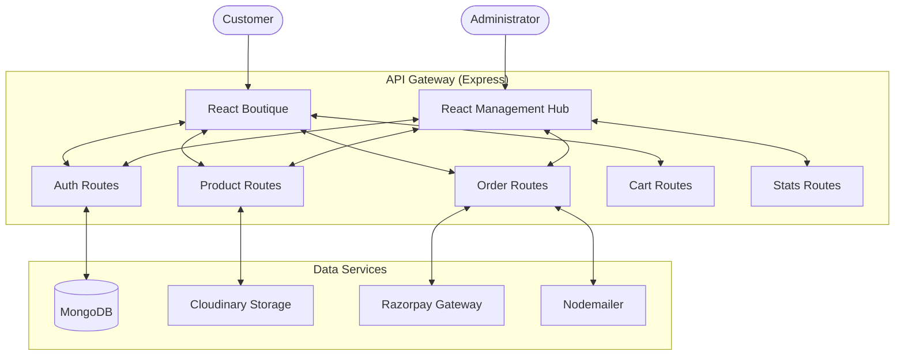
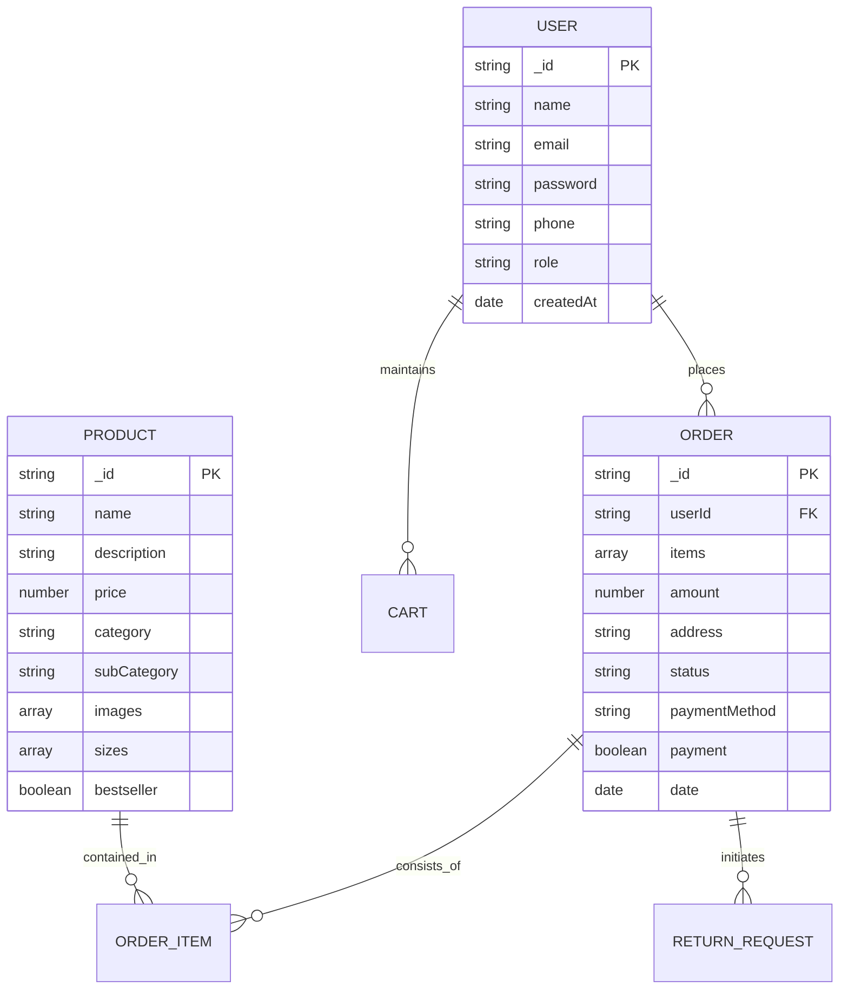

# 🎨 Chapter 2: System Analysis & Design

This chapter outlines the architectural blueprints and data models that form the backbone of the VEBStore ecosystem.

## 2.1 System Architecture
VEBStore uses a three-tier architecture:
- **Presentation Layer**: React 19 (Frontend & Admin)
- **Logic Layer**: Node.js & Express 5 (Backend)
- **Data Layer**: MongoDB (Database) & Cloudinary (Assets)

### 2.1.1 Architecture Visual

## 2.2 Database Schema (Entity-Relationship Diagram)
VEBStore utilizes a non-relational model optimized for high-performance retail lookups.

## 2.3 Key Use Cases
### 2.3.1 Customer Use Case
- **Account Management**: Signup/Login/Profile Update.
- **Product Discovery**: Search, Filter by Category, View Details.
- **Purchase Cycle**: Cart management, Place Order (COD/Online).
- **Post-Purchase**: Order tracking, Cancellation, Request Return/Exchange.

### 2.3.2 Administrator Use Case
- **Inventory Control**: Add/Edit/Remove products.
- **Operational Management**: Status updates (Processing, Shipped, Delivered), Approve Returns.
- **Analytics**: Revenue tracking and inventory health reports.

---
*VEBStore · Final Year Project Documentation Series*
